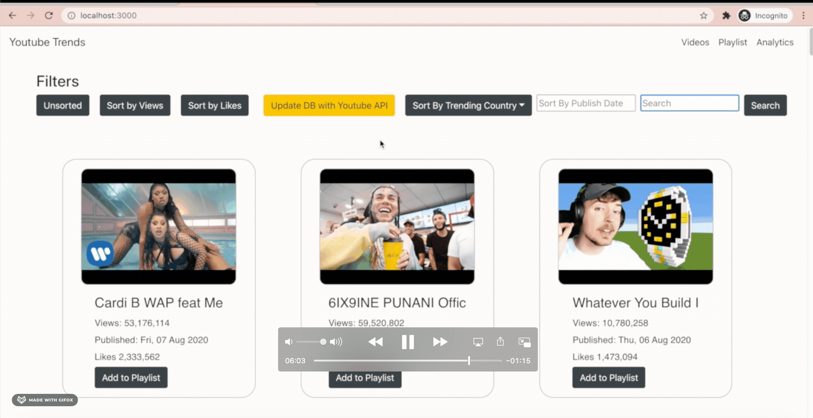

# YouTrends
UW 2020 - CS348 Project

YouTrends is a Youtube video analytics platform.
You can filter videos on a variety of attributes and see graphical trends to get a better idea of what’s hot and what’s not. If you see an interesting video you can also save it to a playlist to come back to it later.
You can access it on any web browser. You're always up to date with YouTrends!

**NOTE: The GCP project has been disabled so the app can no longer be run.**

# App Preview
There is an attached demo `Demo.mp4` for a complete app-overview.

# Location of Files That Implement Features
### Backend
- Updating the database with Youtube API - `code/youtube-trends-backend/app/youtube_api.py`
- Backend API for getting filtered data - `code/youtube-trends-backend/app/routes.py`
- Login with Google (/login and /authorize routes) - `code/youtube-trends-backend/app/routes.py` 
- Playlists - `code/youtube-trends-backend/app/routes.py` 

### Frontend
- User interface for interacting with Backend - `code/youtube-trends-web/src/App.jsx`

## How to Use (deprecated)
You will need the `npm` command to run the project.
 
`cd` into the directory of this project
 
Run the command `chmod +x install.sh` and `chmod +x run.sh`
This gives us our scripts permissions to run.
 
Followed by `./install.sh`
then run with `./run.sh`

This will start the frontend on localhost:3000, we have the backend deployed at https://cs348-project-279101.uc.r.appspot.com/, so you should be able to view videos and use all features directly. If you encounter an issue we recommend closing the tab and revisiting "localhost:3000", or stopping the app using "ctrl + c" from the command line and then re-running `./run.sh`.

